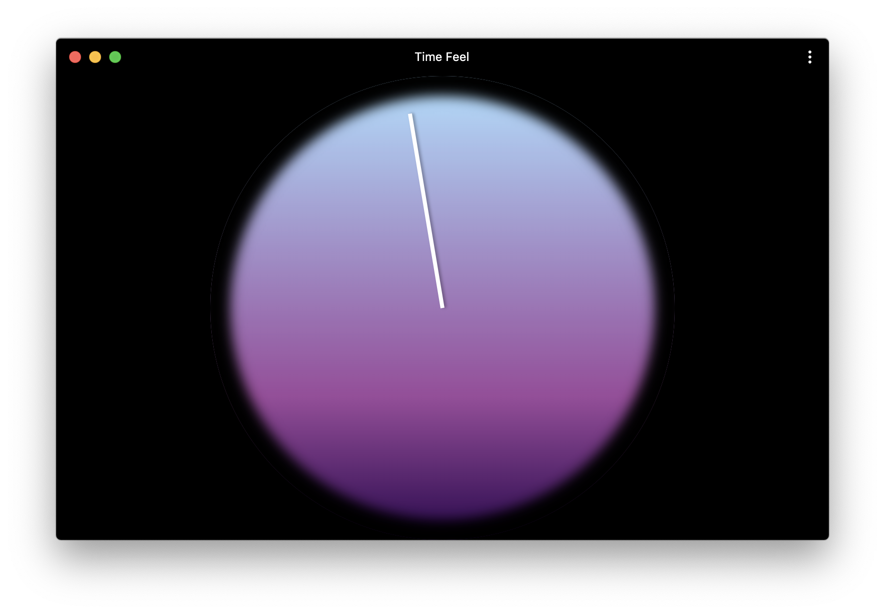

<h1 align="center"><a href="https://guinane.xyz/Time-Feel/"><em>Time Feel</em></a></h1>

Inspired by Scott Thrift's now discontinued [Today Clock](https://timeincolor.com/products/today), *Time Feel* is a simple clock that gives you a sense of what time it is and visualize how much of today there is left. The bottom of the clock marks midnight, and the top marks noon. A gradient conveys the shift from night to day.

*Time Feel* can be accsessed online at [guinane.xyz/Time-Feel](https://guinane.xyz/Time-Feel/), or downloaded to your device as a [Progressive Web App](https://www.howtogeek.com/fyi/how-to-install-progressive-web-apps-pwas-in-chrome/).
